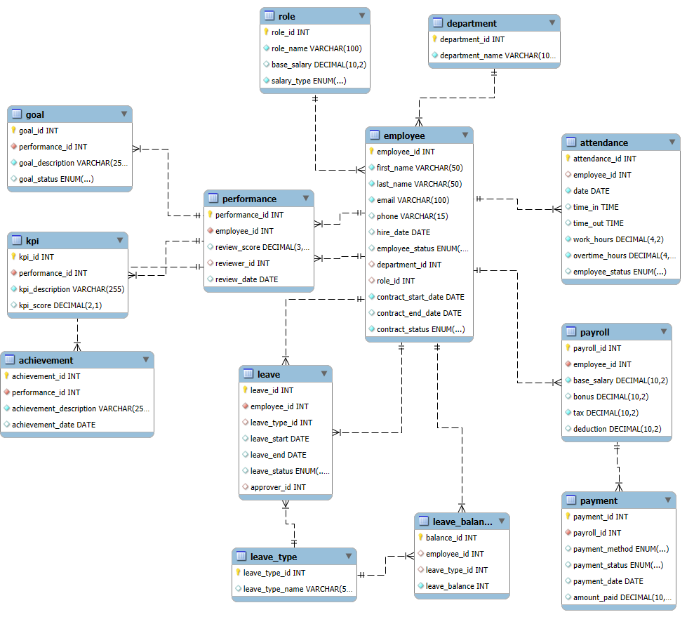

# Employee-Management-System Database structure 

## Table of Tables

1. [Employee table](#1-employee-table)
2. [Department table](#2-department-table)
3. [Role table](#3-role-table)
4. [Attendance table](#4-attendance-table)
5. [Performance table](#5-performance-table)
6. [KPI table](#6-kpi-table)
7. [Goal table](#7-goal-table)
8. [Achievement table](#8-achievement-table)
9. [Payroll table](#9-payroll-table)
10. [Payment table](#10-payment-table)
11. [Leave table](#11-leave-table)
12. [Leave type table](#12-leave-type-table)
13. [Leave balance table](#13-leave-balance-table)

## Overwiew
Before describing stucture of database let us have a look at the visualisation of it to better comprehend the idea behind it, notice that all the names are in lowercase and singular:

## Database employee_management_system - table structure

It is important to note that all primary keys have the `AUTO_INCREMENT` attribute enabled. When these keys are used as foreign keys in other tables, they are associated with either `ON DELETE SET NULL` or `ON DELETE CASCADE` constraints, depending on whether the foreign key is critical to the integrity of the referencing table.
| Term                | Meaning                                                        | Usage in this database                                |
|---------------------|----------------------------------------------------------------|---------------------------------------|
| `ON DELETE SET NULL`  | Sets the foreign key field to `NULL` when the referenced row is deleted.  | Used when the deletion does not render the other table useless (your manager is no longer in our database but your leave still can be there) |
| `ON DELETE CASCADE`   | Automatically deletes rows in the child table when the referenced row is deleted. | Used when deleting table makes other useless, why you need to keep reviews for employee 44 if there no loger exist person with such ID          |

This will clarify the meaning and when to use each constraint, and it will stand out with inline code 
### 1. Employee table 
 This table is heart and soul of our database:
 | Field              | Type                                           | Comment          |
|--------------------|------------------------------------------------|------------------|
| `employee_id`      | `INT` `NOT NULL`                                        | `PRIMARY KEY` |
| `first_name`       | `VARCHAR(50)` `NOT NULL`                                  |  |
| `last_name`        | `VARCHAR(50)`   `NOT NULL`                                 |       |
| `email`            | `VARCHAR(100)` `UNIQUE` `NOT NULL `                               |      |
| `phone`            | `VARCHAR(15)`   `NULL`                              | hopefully this will be enough characters      |
| `hire_date`        | `DATE`                `NULL`                         | The first day of work of emplyee       |
| `employee_status`  | `ENUM('full_time', 'part_time', 'contractor')` `NULL` | Employment Status within our company|
| `department_id`    | `INT ` `NULL`                                         | `FOREIGN KEY` linking to [`department`](#2-department-table)   |
| `role_id`          | `INT `      `NULL`                                    | `FOREIGN KEY` linking to [`role`](#3-role-table)       |
| `contract_start_date`| `DATE`      `NOT NULL`                                 | The start date of current contract, the idea behaind it is if we have employees who continue to work after first contract to have this field changed - change from part to full time i.e.  |
| `contract_end_date`| `DATE`   `NULL`                                      | it should be `NULL` unless the contract already ended |
| `contract_status`  | `ENUM('active', 'expired', 'terminated')`      | Contract Status in case we want to keep records of employees that are not longer working with us  |

The `contract_` entries are the result of my not inplemented ide of contract table, now it looks a bit redundant, but the functionality can be expaded for employees who start 

### 2. Department table
Here whe hold simply name of department, scope of project does not require any more data, but this approach make us flexible and expanding database will be easier.
 | Field              | Type                                           | Comment          |
|--------------------|------------------------------------------------|------------------|
| `department_id` | `INT` `NOT NULL` | `PRIMARY KEY` |
| `department_name` | `VARCHAR(100)` `NOT NULL` | just a simle name is enough for our needs |

### 3. Role table
Here we have the same idea as with the previous table, just to keep data more flexivle and easy to edit or expand in the future.
 | Field              | Type                                           | Comment          |
|--------------------|------------------------------------------------|------------------|
| `role_id` | `INT` `NOT NULL` | `PRIMARY KEY` |
| `role_name` | `VARCHAR(100)` `NOT NULL` | just a simle name is enough for our needs |

### 4. Attendance table 
This is one of the more important tables, here we will record if and how long employee is doing their job.

| Field              | Type                                         | Comment             |
|--------------------|----------------------------------------------|---------------------|
| `attendance_id`     | `INT`  `NOT NULL`           |     `PRIMARY KEY`                |
| `employee_id`       | `INT`  `NULL`                                      | `FOREIGN KEY` linking to [`employee`](#1-employee-table)  |
| `date`             | `DATE` `NOT NULL`                              | The date of attendance |
| `time_in`          | `TIME` `NULL`                                  | Time when the employee checked in, `NULL` in case of abscence |
| `time_out`         | `TIME` `NULL`                                  | Time when the employee checked out, `NULL` in case of abscence |
| `work_hours`       | `DECIMAL(4, 2)` `NOT NULL`                     | Total hours worked without overtime, `0.0` in case of abscence   |
| `overtime_hours`   | `DECIMAL(4, 2)` `NOT NULL`                     | Extra hours worked,  `0.0` in case of abscence    |
| `employee_status`  | `ENUM('present', 'absent', 'leave', 'remote')` `NULL`| Status of attendance, that will be important for calculating salary |

### 5. Performance table
Here table is responsible for reviews given for employee, this table itself holds general score given in review, but more importantly it is basis on which we can store [KPIs](#6-kpi-table), [Goals](#7-goal-table) and [Achievements](#8-achievement-table) that are using this ID as foreign key. This structure allows us to connect multiple KPIs, Goals and Acheviements connected to one review.

| Field            | Type                                | Comment                                    |
|------------------|-------------------------------------|--------------------------------------------|
| `performance_id` | `INT` `NOT NULL`                   | `PRIMARY KEY`      |
| `employee_id`    | `INT` `NOT NULL`                   | `FOREIGN KEY` linking to [`employee`](#1-employee-table) coresponding to person who is being rewiewed   |
| `review_score`   | `DECIMAL(3,1)` `NOT NULL`          | Score between 1 and 10                     |
| `reviewer_id`    | `INT` `NULL`                       | `FOREIGN KEY` linking to [`employee`](#1-employee-table)  corresponding to person writing review |
| `review_date`    | `DATE` `NULL`                      | Date of the performance review             |

### 6. KPI table

First of our tables based on [performance](#5-performance-table), here we will grade employee skills in different cathegories

| Field            | Type                                | Comment                                    |
|------------------|-------------------------------------|--------------------------------------------|
| `kpi_id`         | `INT` `NOT NULL`                   | `PRIMARY KEY`         |
| `performance_id` | `INT` `NOT NULL`                   | `FOREIGN KEY` linking to [`performance`](#5-performance-table) |
| `kpi_description`| `VARCHAR(255)` `NOT NULL`          | Description of the KPI which is measured                    |
| `kpi_score`      | `DECIMAL(2,1)` `NOT NULL`          | Score between 1 and 5                      |

### 7. Goal table
In this table using [performance](#5-performance-table), we will list employee progress on achieveing goals

| Field            | Type                                | Comment                                    |
|------------------|-------------------------------------|--------------------------------------------|
| `goal_id`        | `INT` `NOT NULL`                   | `PRIMARY KEY`,       |
| `performance_id` | `INT` `NOT NULL`                   | `FOREIGN KEY` linking to [`performance`](#5-performance-table) |
| `goal_description`| `VARCHAR(255)` `NOT NULL`          | Description of the goal - make sure it's worthy                    |
| `goal_status`    | `ENUM('not started','in progress','achieved')` `NOT NULL` | Current status of the goal            |

### 8. Achievement table 
The last of the tables working closely with [performance](#5-performance-table) is used to store achievements and their dates
| Field               | Type                                | Comment                                    |
|---------------------|-------------------------------------|--------------------------------------------|
| `achievement_id`    | `INT` `NOT NULL`                   | `PRIMARY KEY`, `AUTO_INCREMENT`            |
| `performance_id`    | `INT` `NOT NULL`                   | `FOREIGN KEY` linking to  [`performance`](#5-performance-table) |
| `achievement_description`| `VARCHAR(255)` `NOT NULL`      | Description of the achievement, here you make sure it was significant             |
| `achievement_date`  | `DATE` `NOT NULL`                  | Date when the achievement was made         |

### 9. Payroll table
If you will use this database in prod, this is most important table for you, you don't want angry employees who didn't get paid because you screwed up something here. This table deals with calculating money we need to pay to employee.

| Field            | Type                                | Comment                                    |
|------------------|-------------------------------------|--------------------------------------------|
| `payroll_id`     | `INT` `NOT NULL`                   | `PRIMARY KEY`            |
| `employee_id`    | `INT` `NOT NULL`                   | `FOREIGN KEY` linking to [`employee`](#1-employee-table) table  |
| `base_salary`    | `DECIMAL(10,2)` `NOT NULL`         | Basic salary of the employee                |
| `bonus`          | `DECIMAL(10,2)` `NULL`              | Bonus added to salary because of reasons, defaults to 0, `CHECK (bonus >= 0)` |
| `tax`            | `DECIMAL(10,2)` `NOT NULL`         | Tax amount, will not default to 0, you need to pay goverment, `CHECK (tax >= 0)`            |
| `deduction`      | `DECIMAL(10,2)` `NULL`              | Deduction amount for different miscellaneous entries, maybe employee destroyed something, defaults to 0, `CHECK (deduction >= 0)` |

### 10. Payment table
You remember why Payroll was important? Great. This table is the same, it deals with sending money to employees. Its important process, so make sure no status is failed.
| Field            | Type                                | Comment                                    |
|------------------|-------------------------------------|--------------------------------------------|
| `payment_id`     | `INT` `NOT NULL`                   | `PRIMARY KEY`            |
| `payroll_id`     | `INT` `NOT NULL`                   | `FOREIGN KEY` linking to [`payroll`](#9-payroll-table)table  |
| `payment_method` | `ENUM('bank transfer','cash','check')` `NOT NULL` | Method in which payment was made so employee does not say that dog ate their check after receiving cash                |
| `payment_status` | `ENUM('paid','failed','pending')` `NOT NULL` | Status of the payment, make sure to do something if it is `failed`        |
| `payment_date`   | `DATE` `NULL`                      | Date when the status is changed to `paid` or `failed` so pending can have no date - there is no money for employee and government cares about that                      |
| `amount_paid`    | `DECIMAL(10,2)` `NULL`              | Amount paid to employee so if they want payment split in different methods we can keep track to that                               |

---

### 11. Leave table 

Some manager is angry that their worker is not here and does not pick up phone? He should first look up data in this table, this person is on a leave.
| Field               | Type                                | Comment                                    |
|---------------------|-------------------------------------|--------------------------------------------|
| `leave_id`          | `INT` `NOT NULL`                   | `PRIMARY KEY`,             |
| `employee_id`       | `INT` `NOT NULL`                   | `FOREIGN KEY` linking to [`employee`](#1-employee-table) coresponding to person yearning for a little of sunlight  |
| `leave_type_id`     | `INT` `NULL`                       | `FOREIGN KEY` linking to [`Leave type`](#12-leave-type-table) |
| `leave_start`       | `DATE` `NOT NULL`                  | First day of the leave                   |
| `leave_end`         | `DATE` `NULL`                      | Last day of freedom for them                     |
| `leave_status`      | `ENUM('pending','approved','rejected')` `NOT NULL` | Current status of the leave approval, defaults to 'pending'  |
| `approver_id`       | `INT` `NULL`                       | `FOREIGN KEY` linking to [`employee`](#1-employee-table) coresponding to manager of the employee  |

### 12. Leave type table

Diferent legislation system have different type of leaves. Keeping one pool of free days is not really viable in real life so we have different pools for different types of leaves. Here we will specify the types we have to make sure we follow law.

| Field              | Type                                | Comment                                    |
|--------------------|-------------------------------------|--------------------------------------------|
| `leave_type_id`    | `INT` `NOT NULL`                   | `PRIMARY KEY`         |
| `leave_type_name`  | `VARCHAR(50)` `NULL`               | Name of the leave type                     |
   
### 13. Leave balance table
So we just specified types of leaves, now we can give every employee the different poll based on their rights

| Field               | Type                                | Comment                                    |
|---------------------|-------------------------------------|--------------------------------------------|
| `balance_id`        | `INT` `NOT NULL`                   | `PRIMARY KEY`          |
| `employee_id`       | `INT` `NOT NULL`                   | `FOREIGN KEY` linking to [`employee`](#1-employee-table)   |
| `leave_type_id`     | `INT` `NULL`                       | `FOREIGN KEY` linking to [`Leave type`](#12-leave-type-table) |
| `leave_balance`     | `INT` `NOT NULL`                   | Days of this type of leave left for employee to use                     |

